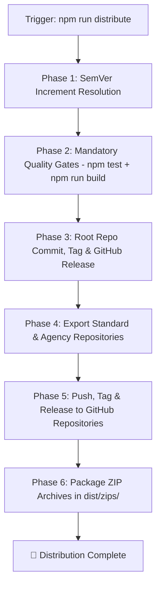

# NextLaunch Pro — Release & Distribution Skill

Use this skill whenever you need to publish a new release, tag a version, export commercial repositories, or distribute NextLaunch Pro across GitHub organizations and ZIP archives.

> [!CAUTION]
> **Internal Maintainer Skill Only**: This skill exists exclusively in the root repository for deployment workflows and is automatically excluded from exported customer repositories (`nextlaunch-standard` and `nextlaunch-agency`).

---

## ⚡ Quick Release Commands

Run the automated distribution pipeline with one command:

```bash
# 1. Automatic SemVer bump (calculates patch/minor/major based on recent git commits):
npm run distribute

# 2. Force specific SemVer increment:
npm run distribute -- --patch    # e.g., v0.1.0 -> v0.1.1 (Bug fixes)
npm run distribute -- --minor    # e.g., v0.1.0 -> v0.2.0 (New features)
npm run distribute -- --major    # e.g., v0.1.0 -> v1.0.0 (Breaking changes)

# 3. Explicit custom tag:
npm run distribute -- --tag=v1.0.0
```

---

## 🔄 Automated Distribution Protocol

The distribution runner (`scripts/distribute.ts`) executes the following 7-phase release pipeline:



### 1️⃣ Phase 1: SemVer Increment Resolution (`v{major}.{minor}.{patch}`)
- Reads current latest git tag (e.g. `v0.1.0`).
- Inspects commit history since last tag:
  - Commit contains `BREAKING CHANGE` or `!:` $\rightarrow$ **Major Bump** (`v1.0.0`).
  - Commit contains `feat:` or `feat(...):` $\rightarrow$ **Minor Bump** (`v0.2.0`).
  - Other commits (`fix:`, `refactor:`, `chore:`) $\rightarrow$ **Patch Bump** (`v0.1.1`).
- Syncs `version` field inside `package.json`.

### 2️⃣ Phase 2: Mandatory Quality Gates
Before any distribution can occur, the pipeline runs two hard gates:
1. `npm test` (All Vitest backend unit test suites must pass 100%).
2. `npm run build` (Next.js 16 App Router Turbopack production compilation must succeed with 0 errors).

### 3️⃣ Phase 3: Root Repo Commit & Release
- Stages all changes (`git add -A`).
- Creates release commit (`chore(release): release vX.Y.Z`).
- Pushes `main` branch to remote.
- Creates annotated tag `vX.Y.Z` and pushes tag.
- Publishes GitHub Release via GitHub CLI (`gh release create`).

### 4️⃣ Phase 4: Commercial Repository Export
- Exports source code to `dist/repos/nextlaunch-standard` and `dist/repos/nextlaunch-agency`.
- Generates tailored `package.json` with matching SemVer version, strict devDependencies (`@types/node: ^22`, `vitest: ^5.0.1`, `vite: ^8.3.0`), and test runner scripts.
- Applies corresponding commercial licenses (`LICENSE-STANDARD.txt` / `LICENSE-AGENCY.txt`).
- Writes tailored documentation (`README.md`).
- **Internal Exclusions**: Strips all internal maintenance files and skills (`nextlaunch-distribute`).

### 5️⃣ Phase 5: Multi-Repo Push & Release
- Commits and pushes `main` branch for `DevPreFlight/nextlaunch-standard` and `DevPreFlight/nextlaunch-agency`.
- Creates and pushes matching `vX.Y.Z` tag on each remote repo.
- Publishes official GitHub Releases with auto-generated release notes on both repositories.

### 6️⃣ Phase 6: ZIP Archive Compression
- Generates clean, standalone ZIP archives in `dist/zips/`:
  - `dist/zips/nextlaunch-standard.zip`
  - `dist/zips/nextlaunch-agency.zip`

---

## 🛡️ Maintainer Checklist Before Release

1. Verify environment variables in `.env.example` are documented.
2. Confirm new backend services have corresponding unit tests in `tests/unit/`.
3. Check that `npx tsc --noEmit` reports 0 errors.
4. Run `npm run distribute`.
